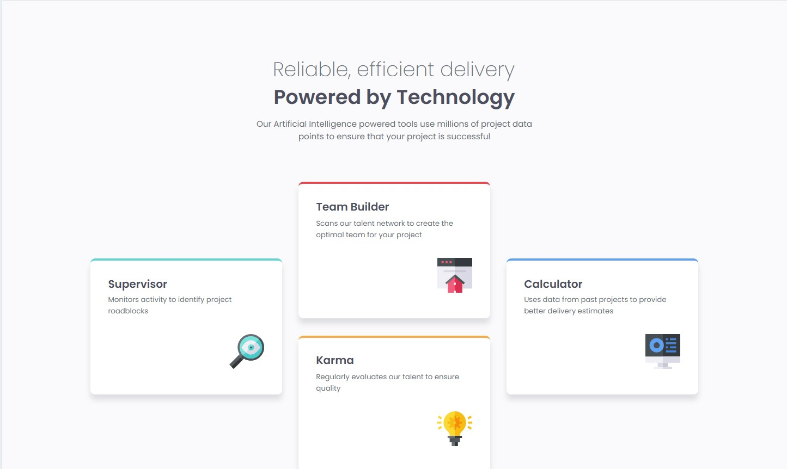
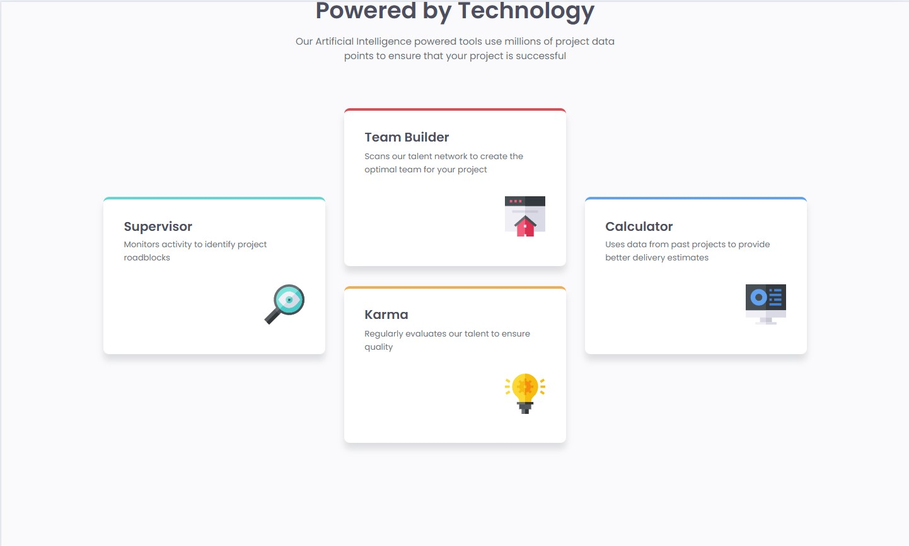
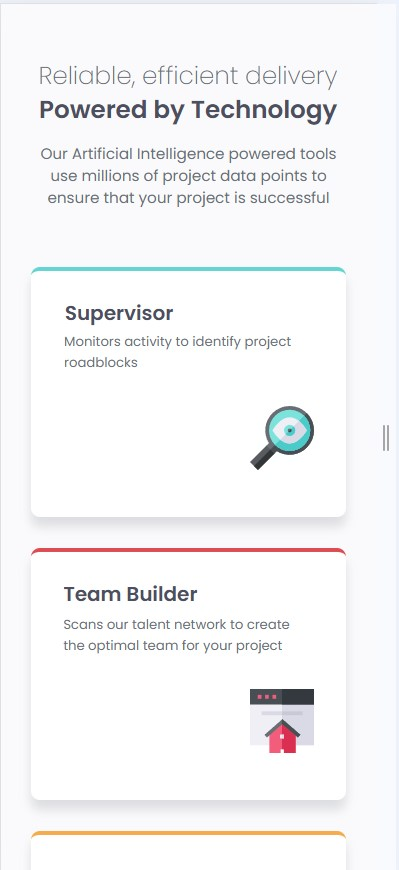
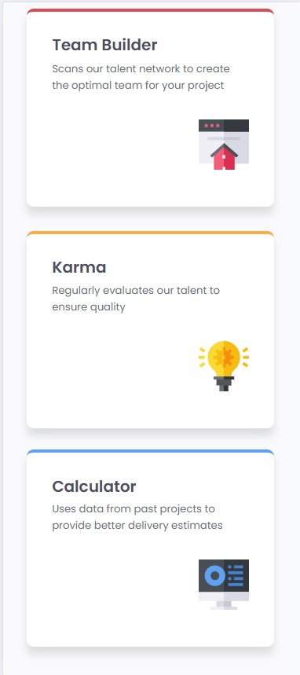

# Frontend Mentor - Four card feature section solution

This is a solution to the [Four card feature section challenge on Frontend Mentor](https://www.frontendmentor.io/challenges/four-card-feature-section-weK1eFYK). Frontend Mentor challenges help you improve your coding skills by building realistic projects. 

## Table of contents

- [Overview](#overview)
  - [The challenge](#the-challenge)
  - [Screenshot](#screenshot)
  - [Links](#links)
- [My process](#my-process)
  - [Built with](#built-with)
  - [Useful resources](#useful-resources)
- [Author](#author)

## Overview

### The challenge

Users should be able to:

- View the optimal layout for the site depending on their device's screen size

### Screenshot

#### Desktop

#### Mobile 

### Links

- Solution URL: [Solution URL](https://github.com/AnthonyCampana/four-card-feature-section-master)
- Live Site URL: [live Site URL](https://anthonycampana.github.io/four-card-feature-section-master/)

## My process

### Built with

- Semantic HTML5 markup
- CSS custom properties
- Flexbox
- Mobile-first workflow

### Useful resources

- [mozilla documentation](https://developer.mozilla.org/en-US/docs/Learn_web_development) - I utilized this resource by going through the documentation to understand what properties I need to use to replicate the design. 

## Author

- Website - [Anthony Campana ](https://anthonycampana.pythonanywhere.com/)
- Frontend Mentor - [@AnthonyCampana](https://www.frontendmentor.io/profile/AnthonyCampana)
